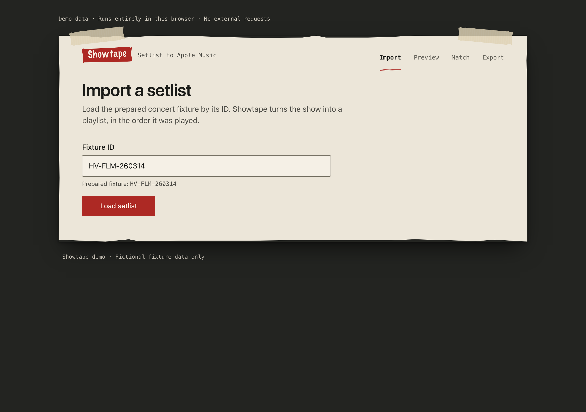
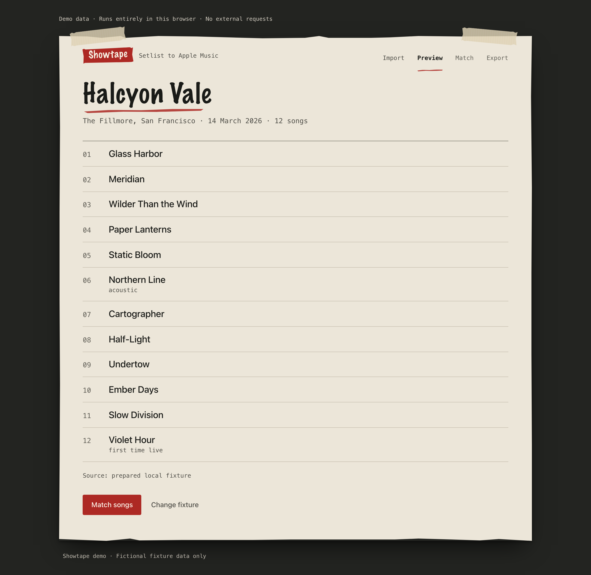
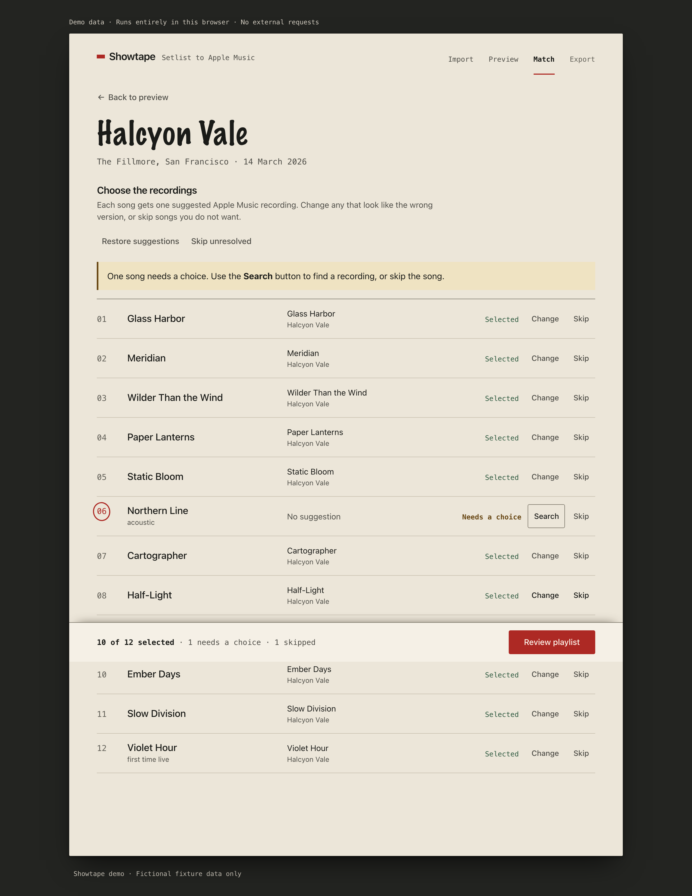
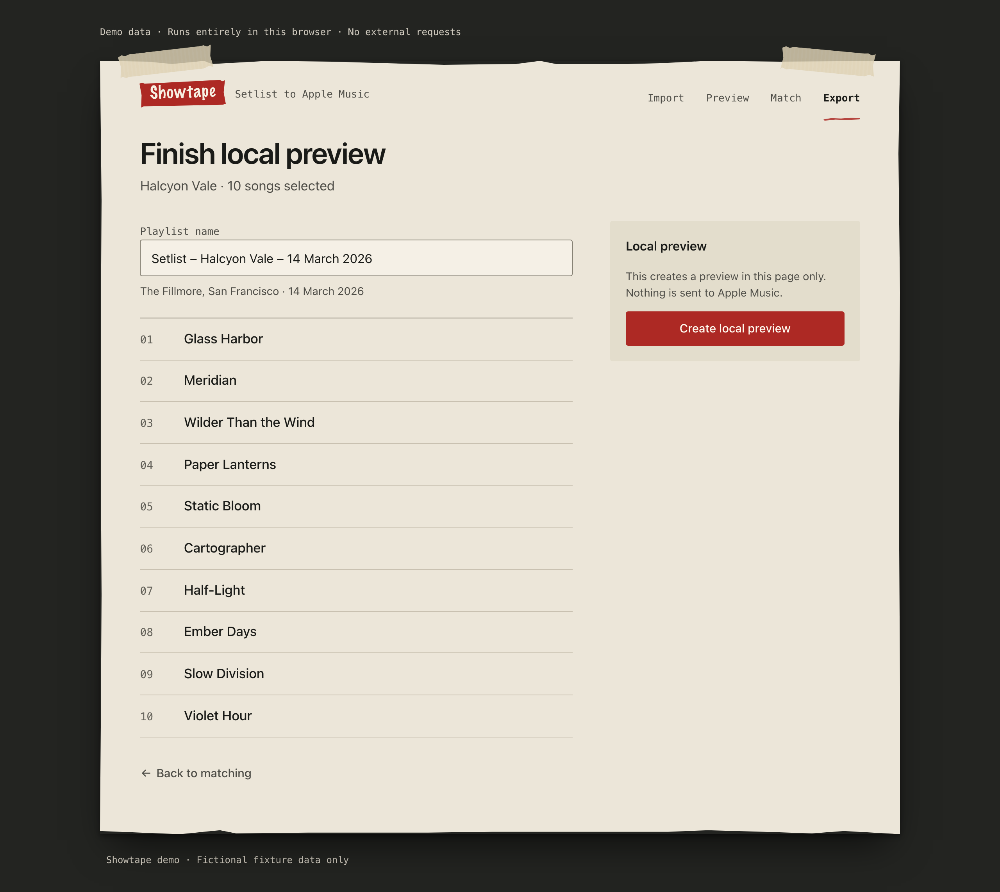
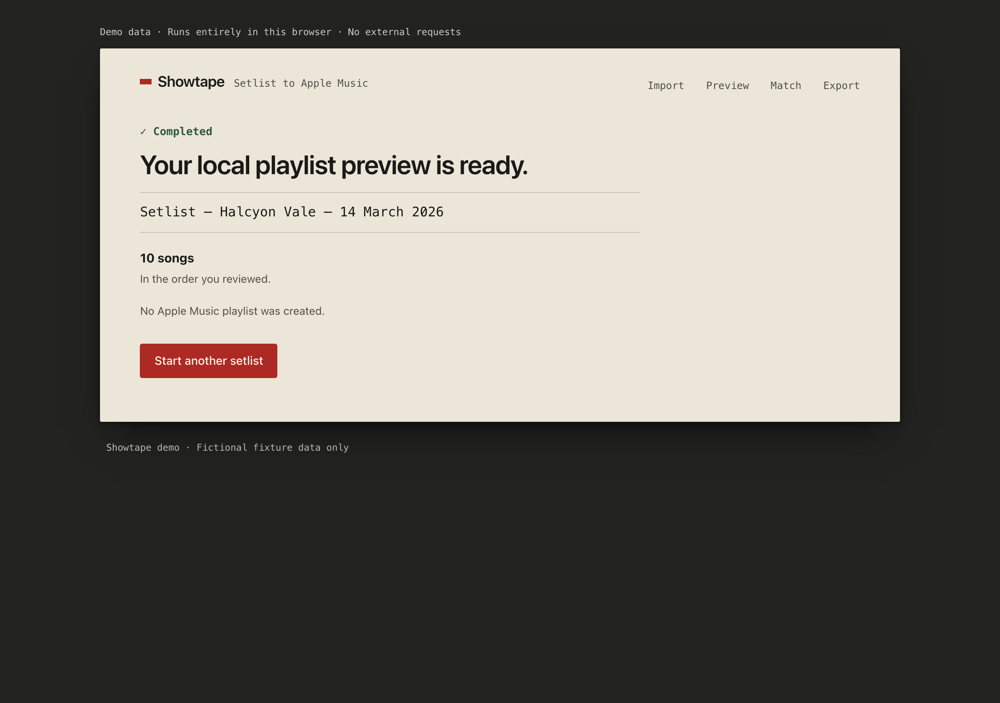
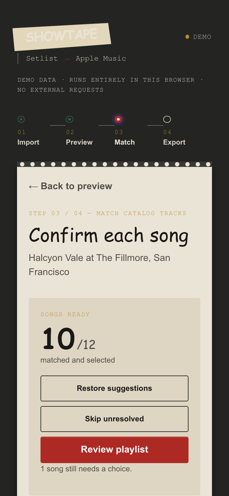

# Showtape

**Turn one concert setlist into an ordered Apple Music playlist — with every match in your hands.**

[](https://github.com/sebastianspicker/showtape/actions/workflows/ci.yml)
[](LICENSE)

Showtape starts from a setlist.fm setlist, suggests Apple Music matches, and
then gets out of the way while you fix what it got wrong. Nothing is written to
your library until you say so, and a match you have not approved is never
treated as certain.

> Showtape is an early alpha (`0.3.0-alpha.1`). Interfaces and configuration can
> change between releases.

## What it does

1. **Import** — paste a setlist.fm URL, or the 4–12 character hexadecimal setlist ID.
2. **Preview** — check the artist, venue, date, and the ordered song list. Tape
   entries are left out.
3. **Match** — accept the suggestions, search the Apple Music catalog yourself,
   replace a pick, or skip a song.
4. **Export** — review your selection, authorize Apple Music, and create the playlist.

At least one selected track is required before anything is written.

Showtape keeps setlist.fm attribution visible, remembers your eight most recent
inputs in browser `localStorage`, and can hold a known partial export in
`sessionStorage` for 30 minutes. It deliberately does not do multiple-setlist
imports, non-Apple export targets, offline use, background sync, or accounts.
If an Apple Music write ends with an unknown outcome, Showtape does not retry it
automatically.

## Try it without credentials

**[Open the interactive demo →](https://sebastianspicker.github.io/showtape/)**

The demo runs entirely in your browser on bundled fictional data. It makes no
setlist.fm or Apple Music requests and creates nothing. GitHub Pages publishes
this simulated artifact only — never the live Next.js app.

## Screenshot tour

Captured from the static demo, so every name and track below is fictional.

**1. Import a setlist** — paste a setlist.fm URL or ID.



**2. Preview the show** — confirm the details and the ordered, tape-free songs.



**3. Match the songs** — accept suggestions, search manually, or skip. Unresolved
and skipped rows stay visible instead of quietly disappearing.



**4. Review the playlist** — check what will be added and name the playlist.



**5. Done** — a success screen that only appears after the write is confirmed.



At narrow widths the same workflow reflows to a single column:



## Requirements

- Node.js 20.9 or later
- pnpm 9.15.3 via Corepack (on Node 25+, which dropped Corepack, use `npx pnpm@9.15.3`)
- A setlist.fm API key for live imports
- An Apple Developer account with MusicKit configured for live Apple use
- An Apple Music subscription to create playlists

Automated checks never need live credentials.

## Quick start

Run everything from the repository root:

```bash
git clone https://github.com/sebastianspicker/showtape.git
cd showtape
cp .env.example .env
corepack pnpm@9.15.3 install --frozen-lockfile
corepack pnpm@9.15.3 dev
```

Fill in `.env` before you exercise the live integrations, then open
`http://localhost:3000`. Keep the populated file out of git.

| Variable                         | Needed for                         | Visibility                    |
| -------------------------------- | ---------------------------------- | ----------------------------- |
| `SETLISTFM_API_KEY`              | Live setlist import                | Server only                   |
| `APPLE_TEAM_ID`                  | Apple developer-token signing      | Server only                   |
| `APPLE_KEY_ID`                   | Apple developer-token signing      | Server only                   |
| `APPLE_PRIVATE_KEY`              | Apple developer-token signing      | Server only                   |
| `NEXT_PUBLIC_APPLE_MUSIC_APP_ID` | MusicKit initialization            | Browser-visible build setting |
| `ALLOWED_ORIGIN`                 | Production API CORS policy         | Server only                   |
| `TRUST_PROXY`                    | Trusted forwarded-IP rate limiting | Server only                   |

The browser always calls same-origin `/api` routes. `ALLOWED_ORIGIN` and
`TRUST_PROXY` are server HTTP-policy settings, not an alternate API deployment
model. See [deployment and configuration](docs/DEPLOYMENT.md) for setup and
production constraints.

## Commands

Run all commands from the repository root.

| Command                                   | Purpose                                                                 |
| ----------------------------------------- | ----------------------------------------------------------------------- |
| `corepack pnpm@9.15.3 dev`                | Start the development server.                                           |
| `corepack pnpm@9.15.3 build`              | Create the production Next.js build.                                    |
| `corepack pnpm@9.15.3 start`              | Serve an existing production build.                                     |
| `corepack pnpm@9.15.3 format:check`       | Check Prettier formatting.                                              |
| `corepack pnpm@9.15.3 hygiene:check`      | Check the publishable tree for sensitive or local-only material.        |
| `corepack pnpm@9.15.3 lint`               | Run ESLint with zero warnings allowed.                                  |
| `corepack pnpm@9.15.3 check:architecture` | Check source-layer dependencies and cycles.                             |
| `corepack pnpm@9.15.3 typecheck`          | Type-check without emitting files.                                      |
| `corepack pnpm@9.15.3 demo:check`         | Build and validate the static demo in a temporary directory.            |
| `corepack pnpm@9.15.3 demo:build`         | Write the validated demo to ignored `dist/pages`.                       |
| `corepack pnpm@9.15.3 screenshots`        | Regenerate the demo screenshots in `docs/screenshots` (needs Chromium). |
| `corepack pnpm@9.15.3 audit:security`     | Audit production dependencies at moderate severity or higher.           |

## How it fits together

One Next.js process serves the browser app and three API routes:

- `/`, `/privacy`, and `/terms`
- `GET /api/health`
- `GET /api/apple/dev-token`
- `GET /api/setlist/proxy`

The server holds the Apple signing key and the setlist.fm key; the browser never
sees them. MusicKit runs in the browser and talks to Apple directly for catalog
search, authorization, and playlist writes, so your user token, playlist name,
and selected track IDs never pass through Showtape's API.

This is a single private package, not a multi-package monorepo.

| Path                                      | Responsibility                                                               |
| ----------------------------------------- | ---------------------------------------------------------------------------- |
| `src/app`                                 | Pages and layouts; API route files only re-export `src/server/routes`.       |
| `src/contracts`, `src/domain`, `src/http` | Framework-free wire shapes, business transformations, bounded Fetch reading. |
| `src/server`, `src/client`                | Endpoint behavior and integrations; the browser's API caller and MusicKit.   |
| `src/workflow`, `src/ui`                  | The import-to-export journey and generic presentation components.            |
| `demo`, `public`, `scripts`               | Simulated demo source, public assets, and repository checks.                 |

Deeper detail lives in [architecture and runtime flows](docs/architecture.md).

## Documentation

- [Product and interface contract](PRODUCT.md)
- [Architecture and runtime flows](docs/architecture.md)
- [Deployment and configuration](docs/DEPLOYMENT.md)
- [Apple Music integration](docs/tech/apple-music.md)
- [setlist.fm integration](docs/tech/setlistfm.md)
- [Local verification and measurements](docs/verification.md)
- [Contributing](CONTRIBUTING.md)
- [Security policy](SECURITY.md)
- [Privacy](PRIVACY.md) and [terms](TERMS.md)
- [Changelog](CHANGELOG.md)

The automated checks do not prove a complete browser journey, live setlist.fm
access, Apple authorization, playlist writes, or a deployed environment.

## Native app

The `native/` project adds SwiftUI clients for iPhone, iPad, and Mac, targeting
iOS/iPadOS 17 and macOS 14. They reuse this Next.js service for setlist import
and call native MusicKit directly for Apple Music. See
[native setup and verification](native/README.md) for build configuration,
account requirements, recovery behavior, and the mocked test boundary.

## License

Showtape is available under the [MIT License](LICENSE). Apple Music and
setlist.fm use are also subject to their respective terms.
