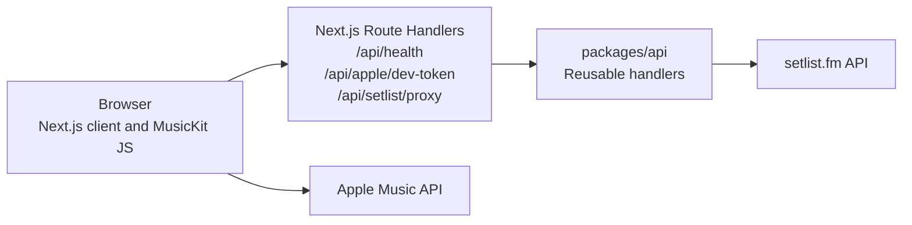

# Architecture

## Runtime model

Showtape runs as one Next.js application. The same process serves the browser
workflow and the API routes.

`apps/web` owns HTTP request parsing, CORS, rate limiting, and response headers.
Its Route Handlers call reusable logic from `packages/api`. The `packages/api` package
has no listener or server entry point.

## Import flow

1. The browser validates a setlist.fm URL or ID.
2. `GET /api/setlist/proxy` parses the input and calls the setlist handler.
3. The handler sends `SETLISTFM_API_KEY` to setlist.fm from the server.
4. The handler validates the minimum upstream shape, maps errors, and returns
   the setlist.
5. The browser maps the response into show metadata and ordered non-tape songs.

Successful setlist responses are cached in process memory for one hour, with a
maximum of 200 entries. Concurrent misses for the same ID share one upstream
request. The complete upstream operation has a 10 second timeout and at most two
bounded retries for HTTP 429 responses.

## Matching flow

The browser obtains a one-hour Apple developer token from
`GET /api/apple/dev-token`, initializes MusicKit, and searches the Apple Music
catalog. Automatic matching processes five songs at a time. Duplicate searches
within one run share a request, and late results do not replace manual changes.

Catalog results use a browser-memory cache with a five-minute lifetime and a
500-entry limit. The user can replace a suggestion, run a manual search, or skip
a song.

## Export flow

MusicKit authorizes the user in the browser. The browser creates the playlist
and adds selected Apple Music song IDs in batches of 100. The MusicKit user
token and playlist payload do not pass through the Showtape API routes.

A definite add-tracks failure can store the exact remaining IDs in
`sessionStorage` for 30 minutes. A transport failure has an unknown external
outcome and cannot be retried automatically.

## State and persistence

- Browser `localStorage`: up to eight recent inputs and parsed setlist IDs.
- Browser `sessionStorage`: export recovery state for up to 30 minutes.
- Server process memory: setlist response cache and rate-limit buckets.
- No application database, account system, service worker, or background job.

## Security boundaries

- `APPLE_PRIVATE_KEY`, `APPLE_TEAM_ID`, `APPLE_KEY_ID`, and
  `SETLISTFM_API_KEY` remain on the server.
- The Apple developer token is returned to the browser for MusicKit.
- The Apple user token remains in MusicKit browser state.
- API JSON responses apply CORS, `X-Content-Type-Options: nosniff`, and
  `X-Frame-Options: DENY`.
- Page middleware applies the content security policy and other browser
  security headers. API routes apply their own response headers.
- Forwarded client IP headers are ignored unless `TRUST_PROXY=1`.

## Package responsibilities

| Package           | Responsibility                                                                 |
| ----------------- | ------------------------------------------------------------------------------ |
| `apps/web`        | Next.js pages, Route Handlers, workflow state, MusicKit client, and web tests. |
| `packages/api`    | Apple developer-token signing and setlist proxy logic.                         |
| `packages/core`   | Setlist parsing, mapping, normalization, signatures, and naming.               |
| `packages/shared` | Shared request, response, constant, and utility definitions.                   |
| `packages/ui`     | Shared React button component.                                                 |

Detailed integration notes are in [docs/tech](tech/).
