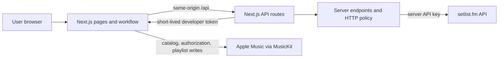
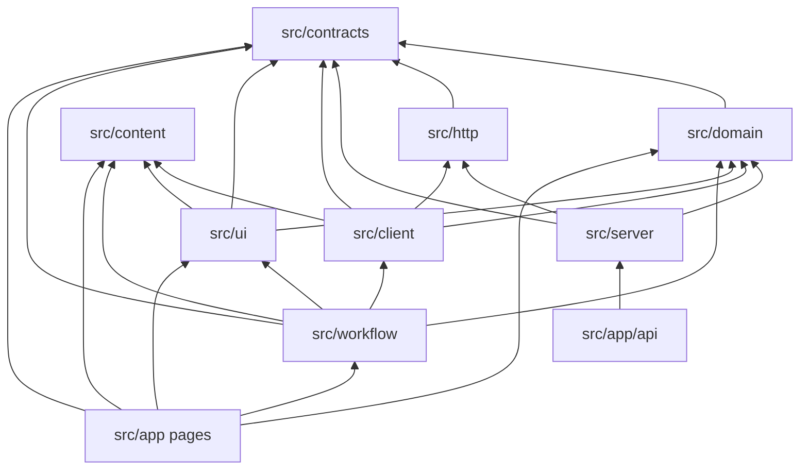

# Architecture

## How it fits together

Showtape is one root Next.js application plus a shared Swift package that backs
the iPhone, iPad, and Mac targets. A single Node.js process serves the browser
interface and three API Route Handlers — there is no separate API service,
database, or queue.

The browser uses Showtape's same-origin API for two things: importing a setlist
and signing an Apple developer token. Everything else Apple-related — catalog
search, user authorization, and playlist writes — goes straight from the
browser to Apple Music. The static demo is built from allowlisted local files
and deliberately has no network or storage access.

```mermaid
flowchart LR
  User[User browser]
  App[Next.js pages and workflow]
  Routes[Next.js API routes]
  Server[Server endpoints and HTTP policy]
  Setlist[setlist.fm API]
  Music[Apple Music via MusicKit]

  User --> App
  App -->|same-origin /api| Routes
  Routes --> Server
  Server -->|server API key| Setlist
  App -->|catalog, authorization, playlist writes| Music
  Routes -->|short-lived developer token| App
```

## Repository boundaries

The web app is a single private pnpm package; its dependency overrides live in
`package.json` under `pnpm.overrides`. Native code lives under `native/` as one
local Swift package with four modules.

| Path            | Responsibility                                                                    |
| --------------- | --------------------------------------------------------------------------------- |
| `src/app`       | App Router pages, layouts and error states; `app/api/**/route.ts` only re-export. |
| `src/contracts` | Shapes shared by server and browser: API error envelope, codes, `Result`.         |
| `src/domain`    | Pure setlist parsing, input rules, entities, naming, signatures, and matching.    |
| `src/http`      | Runtime-neutral bounded Fetch body reading.                                       |
| `src/server`    | Endpoint behavior, env config, HTTP policy, token signing, setlist.fm access.     |
| `src/client`    | `showtape-api.ts` (same-origin Showtape API) and `music/` (browser MusicKit).     |
| `src/workflow`  | The journey (`journey.tsx`) and its stages: `import/`, `matching/`, `playlist/`.  |
| `src/ui`        | Generic controls and presentation reused by app pages and the workflow.           |
| `src/content`   | Product, legal, and attribution copy rendered by the application.                 |
| `src/proxy.ts`  | Page security headers and the per-request content-security-policy nonce.          |
| `tests`         | Contracts grouped by application boundary.                                        |
| `demo`          | Source for the simulated static workflow.                                         |
| `scripts`       | Architecture, public-boundary, and static-demo checks.                            |

`scripts/check-architecture.mjs` is the authoritative dependency contract. It
parses source imports, enforces the allowed layer directions and external
dependency allowlists, and rejects cycles. Higher layers may depend only on the
lower-level boundaries shown here:

```mermaid
flowchart BT
  Contracts[src/contracts]
  Domain[src/domain] --> Contracts
  Http[src/http] --> Contracts
  Content[src/content]
  Server[src/server] --> Contracts
  Server --> Domain
  Server --> Http
  Client[src/client] --> Contracts
  Client --> Domain
  Client --> Http
  Client --> Content
  UI[src/ui] --> Contracts
  UI --> Domain
  UI --> Content
  Workflow[src/workflow] --> Client
  Workflow --> Contracts
  Workflow --> Domain
  Workflow --> UI
  Workflow --> Content
  App[src/app pages] --> Workflow
  App --> UI
  App --> Domain
  App --> Contracts
  App --> Content
  Api[src/app/api] --> Server
```

`src/contracts` and `src/domain` stay framework-free. Concrete I/O stays in
`src/server` or `src/client`, and App Router files stay as composition points.

### Inside the server and the workflow

- `src/server/routes/<endpoint>.ts` owns one endpoint's complete
  request-to-response behavior: rate limiting, input checks, configuration
  lookup, the single mapping to HTTP status and envelope, and headers. Shared
  HTTP policy lives in `src/server/http`; `src/server/config.ts` is the only
  server module that reads the environment (lazily, per call), apart from the
  self-contained CSP code in `src/server/security`. Pure service seams sit
  beside their integration: `apple-token/developer-token.ts` and
  `setlistfm/get-setlist.ts`.
- Each workflow stage has one state owner: `import/useSetlistImport.ts`,
  `matching/useAutoMatch.ts` (rows in `matchesReducer`, `matching/model.ts`)
  with `matching/useTrackSearch.ts`, and `playlist/usePlaylistExport.ts`.
  `journey.tsx` defines the four steps once and owns the current step and
  focus movement. It also keeps a copy of the match rows (the draft), synced
  from the lazily loaded matching stage, so Back and forward navigation keep
  the user's choices; importing a setlist clears it, and a draft saved
  mid-run resumes searching its pending rows. Hooks receive semantic
  callbacks, never another component's state setters.
- `MatchingStep` and `ExportStep` render their headers eagerly and load
  `MatchingWorkflow` and `PlaylistExportWorkflow` lazily, so first-load code
  for `/` contains no MusicKit or catalog code. Apart from those two step
  shells, eager files (`ShowtapeWorkflow`, `journey.tsx`, `import/`) import
  from `matching/` and `playlist/` only with `import type`. This is a
  convention; `tests/browser/bundle-boundary.spec.ts` checks the built chunks.

New code goes where its responsibility already lives: a new endpoint is a
`src/server/routes` module plus a one-line `route.ts`, and its path must be
added to the exclusion in the `src/proxy.ts` matcher (API routes don't get the
document CSP); a new stage concern goes
in that stage's folder; only genuinely generic presentation goes in `src/ui`.

## Runtime flows

### Importing a setlist

1. `src/workflow/import` validates the URL or ID you typed.
2. `src/client/showtape-api.ts` calls same-origin `GET /api/setlist/proxy`.
3. `src/server/routes/setlist.ts` applies rate-limit, input-length, CORS, and
   configuration policy, then calls `getSetlist` in `src/server/setlistfm`.
4. `src/server/setlistfm` sends the server-only API key to setlist.fm, rejects
   redirects, bounds the response body, validates the required fields and the
   requested ID, and maps the response to the domain `Setlist` shape.
5. Tape entries are dropped during mapping. The browser receives only the mapped
   shape, with the validated attribution URL kept visible.

The upstream request has a 10-second total deadline and at most two bounded
retries for HTTP 429. Successful responses are cached in a per-process,
200-entry fixed-TTL LRU cache for one hour when their serialized mapped form is
at most 500,000 characters. Identical in-flight IDs share a single request.
After those fast paths, each process admits at most 32 distinct upstream
operations concurrently and 120 new operations per minute. Retries remain part
of one admitted operation; excess work receives HTTP 429 with `Retry-After`.

### Matching and playlist export

1. The browser fetches a one-hour ES256 developer token from
   `GET /api/apple/dev-token` and caches it for 55 minutes.
2. MusicKit runs in the browser and searches the current storefront. Catalog
   results are cached in browser memory for five minutes, up to 500 entries.
3. Automatic matching runs five replenishing workers. A manual choice stays
   authoritative even if a late automatic result arrives afterward.
4. Once you authorize, the browser creates the playlist and adds the selected
   track IDs in ordered batches of 100.

The MusicKit user token, playlist name, selected IDs, and Apple API responses
never pass through Showtape's API routes. A definite add-tracks failure can keep
the exact remaining IDs for a resume. A transport failure has an unknown
outcome, so the user has to check their Apple Music library before trying again.

## HTTP surface

| Route                       | Purpose                                                     | Important response policy                                                                                    |
| --------------------------- | ----------------------------------------------------------- | ------------------------------------------------------------------------------------------------------------ |
| `GET /api/health`           | Report process liveness and a timestamp.                    | Does not test either external service.                                                                       |
| `GET /api/apple/dev-token`  | Sign an Apple developer token from server credentials.      | No-store; 30 requests per 60 seconds when trusted-proxy limiting is active.                                  |
| `GET /api/setlist/proxy`    | Parse an `id` or `url` query and return the mapped setlist. | Success is private-cacheable for one hour; 20 requests per 60 seconds when trusted-proxy limiting is active. |
| `OPTIONS` on each API route | Return CORS preflight policy.                               | HTTP 204 with no body.                                                                                       |

Errors carry an `error` string and, usually, a stable `code`: `BAD_REQUEST`,
`NOT_FOUND`, `RATE_LIMIT`, `INTERNAL`, or `SERVICE_UNAVAILABLE`. The one
exception is a missing `id` or `url`, whose response has no `code`.

`ALLOWED_ORIGIN` lists the exact allowed origins. When it is unset, only
plain-HTTP `localhost` and `127.0.0.1` origins are allowed; wildcard and `null`
origins are rejected. Per-client rate limiting stays off unless `TRUST_PROXY=1`
and a trusted forwarded client address is available. The process-wide setlist.fm
admission policy is independent of this per-client setting.

## State ownership and failure boundaries

| State                                         | Owner                    | Lifetime                                 |
| --------------------------------------------- | ------------------------ | ---------------------------------------- |
| Imported setlist and match choices            | React workflow state     | Current page session                     |
| Up to eight recent inputs and parsed IDs      | Browser `localStorage`   | Until browser storage is cleared         |
| Known partial playlist progress               | Browser `sessionStorage` | At most 30 minutes                       |
| Setlist response cache and in-flight requests | Next.js process memory   | At most one hour or until restart        |
| Rate-limit buckets                            | Next.js process memory   | Fixed window or until restart            |
| MusicKit developer token and catalog cache    | Browser memory           | 55 minutes and five minutes respectively |

Multiple server processes do not share caches or limiter state. There is no
durable application state, migration system, backup format, background retry, or
cross-instance coordination.

## Security boundaries

- `APPLE_TEAM_ID`, `APPLE_KEY_ID`, `APPLE_PRIVATE_KEY`, and `SETLISTFM_API_KEY`
  stay in the server environment.
- `NEXT_PUBLIC_APPLE_MUSIC_APP_ID` is browser-visible and baked in at build time.
- API responses apply exact-origin CORS, content-type protection, and frame
  denial. `src/proxy.ts` applies page CSP, HSTS, referrer, permissions, and
  related browser headers.
- `TRUST_PROXY=1` is safe only when the reverse proxy strips client-supplied
  forwarded-IP headers and writes trusted values.
- Response readers on both sides reject bodies larger than 10 MiB.

Reporting policy and operator responsibilities live in [SECURITY.md](../SECURITY.md).

## Build and delivery boundaries

The root package builds the web application; Xcode builds the two native
targets. `next build` produces the live application artifact, while
`scripts/build-pages-demo.mjs` produces the separate, ignored `dist/pages`
artifact. The demo builder permits exactly the three files under `demo`, the
shared global stylesheet, the Showtape mark, the tour screenshots under
`docs/screenshots`, and `.nojekyll`; it rejects network, navigation,
persistent-storage, and MusicKit APIs.

The repository has CI but no live-application deployment workflow, container,
process supervisor, reverse-proxy configuration, or rollback automation. See
[deployment and configuration](DEPLOYMENT.md).

## Invariants and non-goals

- Browser calls to Showtape always use same-origin `/api` paths.
- Apple and setlist.fm credentials never enter browser application state.
- The browser MusicKit user token stays in the browser; native MusicKit manages
  its own authorization.
- Setlist order and explicit user corrections are preserved.
- The static demo is simulated and is not live-integration evidence.
- A separately deployed API, multiple-setlist workflow, non-Apple export,
  offline mode, and background synchronization are not implemented.

The reasoning behind the application shape is recorded in
[ADR 0001](adr/0001-stack-nextjs-musickit.md).

## Native module boundaries

`ShowtapeCore` holds immutable Sendable values, pure transformations, and
service protocols. `ShowtapeBackend` uses URLSession for setlist import.
`ShowtapeMusic` owns native MusicKit, catalog caching, local recovery, and
serialized export coordination. `ShowtapeUI` owns the MainActor observable
journey and adaptive SwiftUI screens. Thin platform shells provide app scenes;
the Mac uses one primary window, without Catalyst.

Native import uses the same mapped setlist contract, including tape exclusion.
The native backend URL is a build-time setting and does not change the browser's
same-origin model. Apple search, authorization, and writes go directly from each
client to Apple. Native recovery stays on the device, and unknown writes require
checking Apple Music before starting another export.

Static web HTML is paired with an immutable script-hash manifest and a fresh
response nonce. The startup and runtime verifier fails closed if the artifact is
incomplete. See [deployment](DEPLOYMENT.md) for the hybrid policy and the checks
required on every upgrade.
